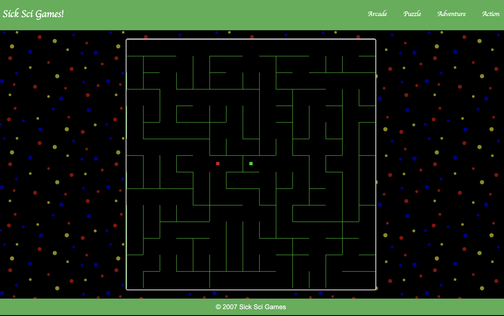

# [irisctf-2024](https://2024.irisc.tf/)

## The Maze

**Category: reverse** 

## Description

The challenge is a maze played in the browser.



After deobfucating the inital string we get a few functions.
f is used to generate a new map with the seed as the parameter.

From the code we get the following interesting parts
```js
n = "Dugd8DbBCXnrEF1kKd2Hg4lsRQ1eV/6gQ+NfwsVhtr4UgeXQFq1m6WctmIljEG7PZg=="

4 !== i.b || 4 !== i.e.length || i.e.some((e=>-1 === e)) || async function(e) {
                  const t = i.e.map((e=>e.toString(16).padStart(8, "0"))).join("")
                    , a = new Uint8Array(atob(e).split("").map((e=>e.charCodeAt(0))))
                    , n = Uint8Array.from([0, 1, 2, 3, 4, 5, 6, 7, 8, 9, 10, 11])
                    , r = (new TextEncoder).encode(t)
                    , c = await crypto.subtle.importKey("raw", r, {
                      name: "AES-GCM"
                  }, !1, ["decrypt"])
                    , o = await crypto.subtle.decrypt({
                      name: "AES-GCM",
                      iv: n
                  }, c, a);
                  return (new TextDecoder).decode(o)
              }(n)
```

So the flag gets decrypted if i.b is 4 and no element in i.e is -1
i.e gets filled in the following code

```js
i.e.push("1,6,11,16" == (e = [...Array(4).keys()].map((e=>i.i.slice(4 * e, 4 * e + 4))),
              t = a[i.b],
              e.map((e=>t[0].map(((e,a)=>t.map((e=>e[a])))).map((t=>e.map(((a,n)=>e[n] * t[n])).reduce(((e,t)=>e + t))))))).flatMap((e=>e)).map((e=>Math.round(100 * e) / 100)).map(((e,t)=>1 === e ? t + 1 : e)).filter((e=>e)) ? i.k : -1);
```

So it is checking for some numbers in i.i which turn out to be our moves on the maze.
However we cant just force it to take i.k since i.k also changes depending on our moves:

```js
i.k = i.k + 211 * (i.g.x + 9) * (i.g.y + 9) * 239 & 4294967295,
```

Extracting the code that is checking i.i the file find_numers.js is created.
The log is speratable into 4 parts and these 4 parts have to be brutefoced individually.
This also has to be done for all the 4 levels.
This is the result for level0

```
result_level0 =
    [
        -19, -29, -29,  -6, 
        -14,  22, 13,  15,  
        18,  16, -13, -12, 
        22,  27,  12, -22,
    ]
```

These numebers map to a specific combination of moves. And calculating the above mentioned i.k at every step gives the following keys:
(done in calculate_moves.js)

```js
[40645774,
130661539,
116339703,
150379278]
```

Now the only thing left is to decode the flag in decode.js


